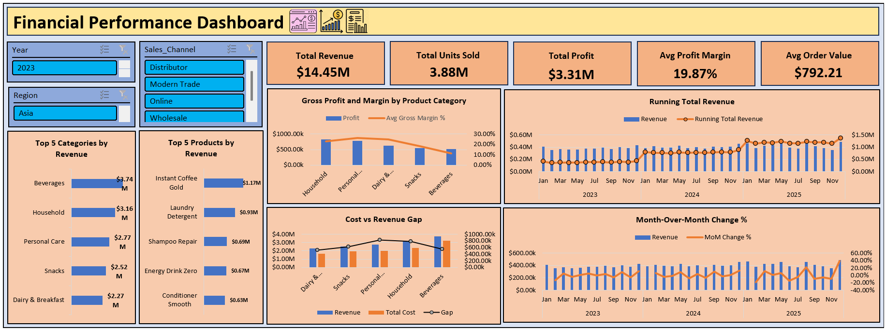
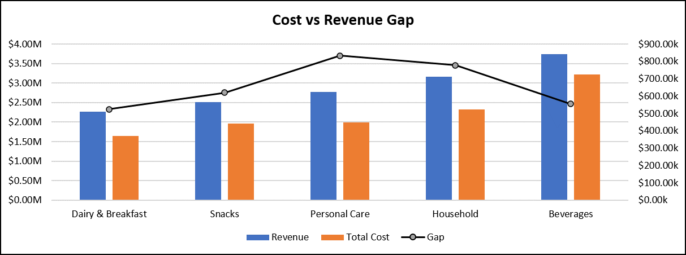

# Financial Performance Analysis Dashboard (Excel)

## Project Overview

Built an interactive Microsoft Excel dashboard to analyze the financial performance of an FMCG retail business. The goal was to identify high-performing products and categories, detect low-margin products, and analyze sales and profit trends to support business decision-making.

**Dataset:** FMCG Sales, Marketing and Profit Data  
**Source:** https://www.kaggle.com/datasets/atharvasoundankar/fmcg-sales-marketing-and-profit-data

---

## Business Problem

The company wants to understand:

- Which products and categories generate the highest revenue and profit?
- Which products reduce overall profitability?
- How are revenue and profit changing over time?
- Which categories offer the best balance between growth and profitability?

---

## KPI Summary

| KPI | Value |
|------|------:|
| Total Revenue | $14.45M |
| Total Profit | $3.31M |
| Total Units Sold | 3.88M |
| Avg Profit Margin | 19.87% |
| Avg Order Value | $792.21 |

---

## Tools Used

- Microsoft Excel
- Pivot Tables & Pivot Charts
- Slicers
- SUMIFS
- XLOOKUP
- INDEX-MATCH
- Conditional Formatting

---

## Key Insights

- **Beverages** generated the highest revenue (**$3.74M**) but had the lowest margin (**11.15%**).
- **Household** products generated the highest profit (**$832.22K**).
- **Personal Care** achieved the highest profit margin (**25.98%**).
- **Instant Coffee Gold** generated the highest revenue (**$1.17M**) but maintained a low margin (**6.72%**).
- Revenue increased consistently from **$4.59M (2023)** to **$5.02M (2025)**.
- Revenue and profit peaked during **December 2025**, indicating strong seasonal demand.

---

## Recommendations

- Review pricing and costs for low-margin products.
- Increase focus on Household and Personal Care categories.
- Monitor products with margins below 10%.
- Use historical trends for future sales forecasting.

---

## Dashboard Features

- KPI Dashboard
- Revenue & Profit Analysis
- Product Performance Analysis
- Category Profitability Analysis
- Month-over-Month Growth Analysis
- Week-over-Week Growth Analysis
- Cost vs Revenue Gap Analysis
- Interactive Slicers

---

## Screenshots

### Dashboard

### Product Analysis

### Profitability Analysis

### Cost vs Revenue Gap

### Category Analysis

---

## Project Information

**Domain:** FMCG / Retail Analytics  
**Tool:** Microsoft Excel  
**Dataset Size:** 100,000+ Transactions
